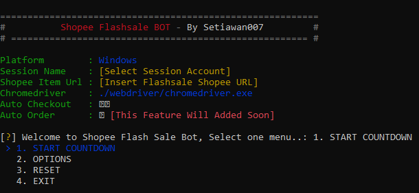
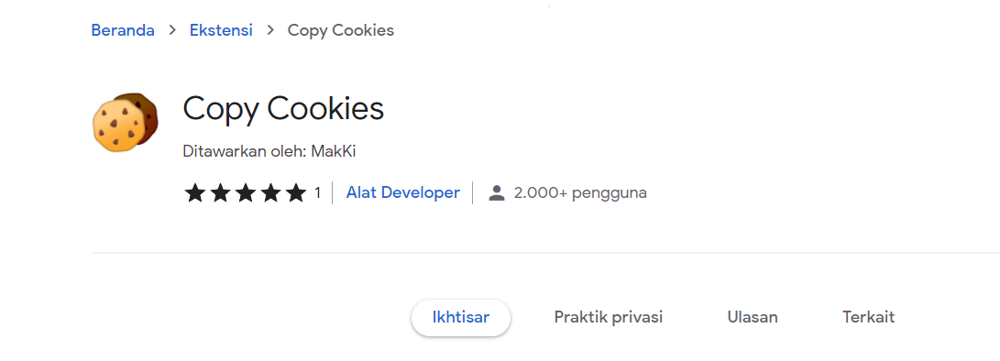
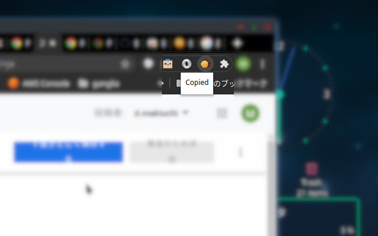
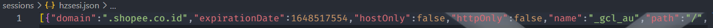
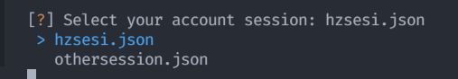

# Shopee Flashsale BOT

## Requirements 
- Python 3.xx
- Google Chrome

## Installation
- git clone https://github.com/Setiawan007/Shopee-Flashsale-BOT
- cd Shopee-Flashsale-BOT

## Start
- python main.py
### or
- py main.py

## Creating session

- Manual login to shopee
- Install copy cookies chrome extension <a href="https://chrome.google.com/webstore/detail/copy-cookies/jcbpglbplpblnagieibnemmkiamekcdg" target="_blank">here</a>

- Click extensions icon on top right at chrome
- Click "copy cookies", that will copy all cookie on your clipboard (Stay on the shopee page that has logged in)

- create a file on sessions folder and end of filename with ext .json (ex: mysession.json)
- paste cookie on clipboard to that file

- then you can select one of active session

## Note
- Android platform isn't supported for now
- If you can't switch menu on windows 10 try to use numpad arrow (with numlock off) - <a href="https://github.com/magmax/python-inquirer/issues/117#issuecomment-1020013883" target="_blank">Reference</a>

## Contact Me
- <a href="https://www.instagram.com/setiawan.007" target="_blank">Instagram</a>
